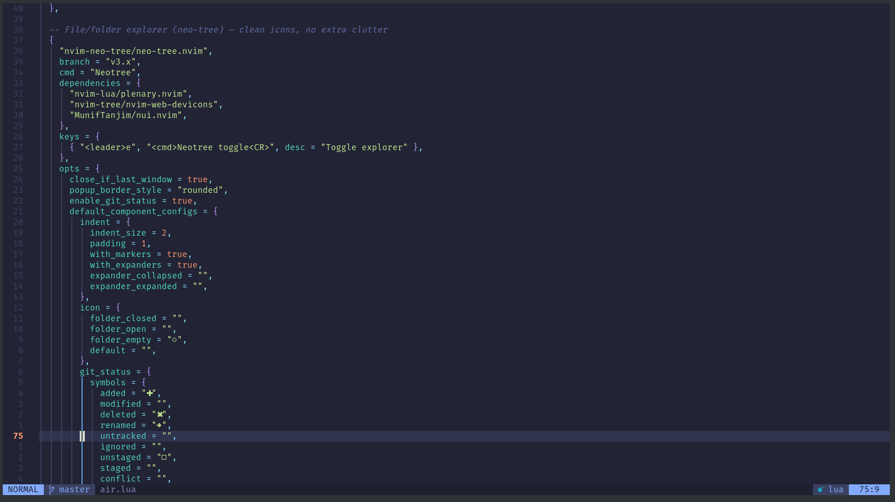

# Neovim

A focused [LazyVim](https://www.lazyvim.org/) configuration for a fast, polished editing workflow.

The configuration is intentionally small and easy to change. Plugin specs are grouped by purpose, while LazyVim continues to provide the base editor experience.



## Structure

```text
~/.config/nvim/
├── init.lua
├── lazy-lock.json
├── lazyvim.json
├── stylua.toml
└── lua/
	├── config/
	│   ├── autocmds.lua
	│   ├── keymaps.lua
	│   ├── lazy.lua
	│   └── options.lua
	└── plugins/
		├── colorscheme.lua
		├── disabled.lua
		├── editor.lua
		├── example.lua.bak
		└── ui.lua
```


## ✨ Features

- ⚡ **Fast startup** with lazy-loaded plugins
- 🗂️ File explorer, fuzzy search, and search/replace tools
- 🧠 Built-in **LSP** support — completion, diagnostics, code actions
- 🎨 Beautiful, cohesive theme and UI
- 🔧 Simple, well-organized structure for easy customization

---

## 📋 Requirements

| Requirement | Notes |
|---|---|
| **Neovim 0.9+** | Core editor |
| **Git** | For cloning and plugin management |
| **A Nerd Font** | Recommended: `JetBrainsMono Nerd Font` or `FiraCode Nerd Font` |
| **ripgrep, fd, lazygit, Node.js** | Optional — enables extra plugin features |

---

## 🚀 Installation

### 1. Install Neovim

**Ubuntu**
```bash
sudo apt update
sudo apt install neovim git
```

**Arch Linux**
```bash
sudo pacman -S neovim git
```

### 2. Install a Nerd Font

Download one of the following and set it as your terminal font:

- [JetBrainsMono Nerd Font](https://www.nerdfonts.com/font-downloads)
- [FiraCode Nerd Font](https://www.nerdfonts.com/font-downloads)
- [CaskaydiaCove Nerd Font](https://www.nerdfonts.com/font-downloads)

### 3. Back up your existing config *(if any)*

```bash
mv ~/.config/nvim ~/.config/nvim.bak 2>/dev/null
mv ~/.local/share/nvim ~/.local/share/nvim.bak 2>/dev/null
mv ~/.local/state/nvim ~/.local/state/nvim.bak 2>/dev/null
mv ~/.cache/nvim ~/.cache/nvim.bak 2>/dev/null
```

### 4. Clone this config

```bash
git clone https://github.com/your-username/your-nvim-config.git ~/.config/nvim
```

Replace the URL with your GitHub repository URL. If the repository already exists locally, copy or link it to `~/.config/nvim` instead.

### 5. Launch Neovim

```bash
nvim
```

LazyVim will automatically install plugins and dependencies on first launch. Wait for the process to finish, then restart Neovim.

---

## 🧭 Recommended Commands

| Command | Description |
|---|---|
| `:Lazy` | Open the plugin manager |
| `:Mason` | Install LSPs, linters, and formatters |
| `:checkhealth` | Diagnose your editor setup |
| `:Telescope find_files` | Search files in project |
| `:Telescope live_grep` | Search text across project |
| `:Oil` | Open the file explorer |

---

## ⌨️ Default Keybindings

| Keybinding | Action |
|---|---|
| `<leader>ff` | Find files |
| `<leader>fg` | Live grep |
| `<leader>fb` | List buffers |
| `<leader>e` | Toggle file explorer |
| `<leader>w` | Save file |
| `<leader>q` | Quit |
| `<leader>h` | Open help |

---

## 🛠️ Customization

All custom configuration lives in a few focused files:

```
lua/
├── config/
│   ├── autocmds.lua   # Autocommands
│   ├── keymaps.lua    # Custom keybindings
│   ├── lazy.lua       # Plugin manager bootstrap
│   └── options.lua    # Editor options
└── plugins/
	├── colorscheme.lua # Themes
	├── disabled.lua    # Disabled defaults
	├── editor.lua      # Editing, LSP, and tools
	└── ui.lua          # Dashboard and interface
```

After making changes, sync your plugins:

```
:Lazy sync
```

---

## 🩺 Troubleshooting

If something isn't working:

```bash
nvim
:checkhealth
:Lazy
```

**Common fixes:**
- Reinstall missing dependencies
- Update Neovim to the latest version
- Confirm your Nerd Font is installed and set in your terminal
- Restart the editor after plugin installs

---
#update readme 
